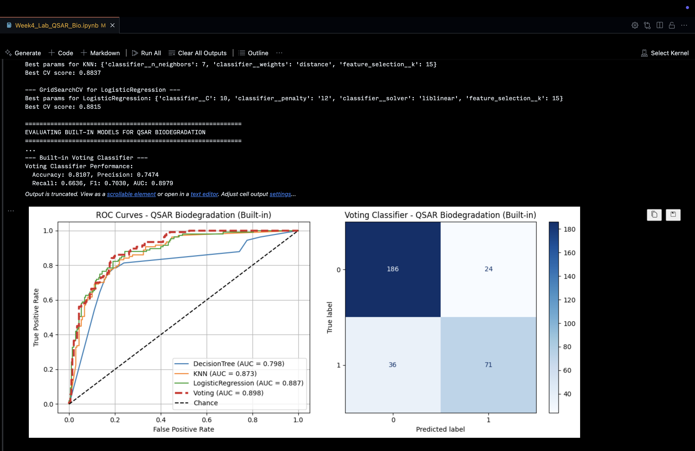
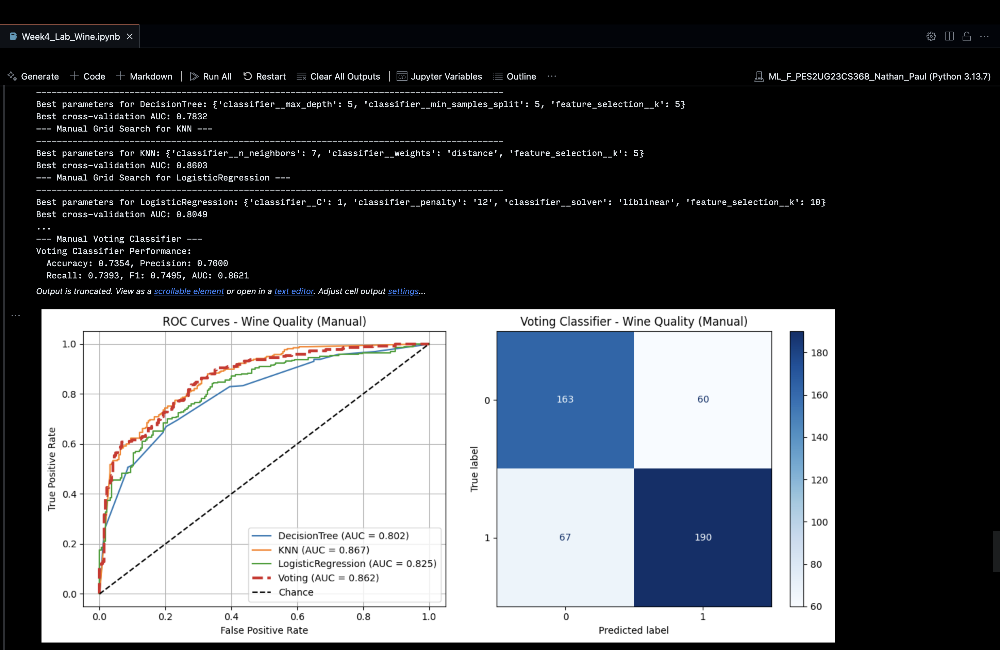
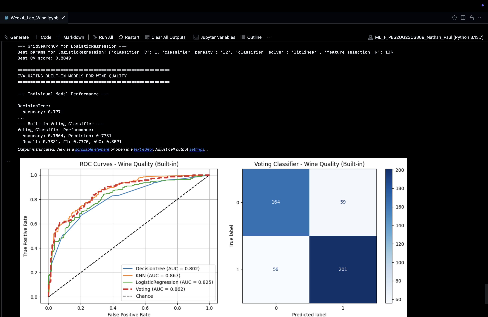

# Week 4: Model Selection and Comparative Analysis

> Name: Nathan Matthew Paul
> Section: F
> SRN: PES2UG23CS368
> Course Name: Machine Learning
> Submission Date: 2025-08-31

# 1. Introduction

This project focuses on building and optimizing classification models for two datasets: **Wine Quality** and **QSAR Biodegradation**. The goal is to predict a binary outcome for each dataset. The models used were **Decision Tree**, **k-Nearest Neighbors (k-NN)**, and **Logistic Regression**. The project compares two methods for hyperparameter tuning: a manual implementation of grid search with cross-validation and scikit-learn's `GridSearchCV`. The performance of these methods was evaluated using multiple metrics.

---

# 2. Dataset Description

- **Wine Quality Dataset**
    - **Features:** 11
    - **Instances:** 1599
    - **Target:** A binary variable indicating good quality (a rating greater than 5).
- **QSAR Biodegradation Dataset**
    - **Features:** 41
    - **Instances:** 1055
    - **Target:** A binary variable indicating if a chemical is "ready biodegradable" (RB) or not.

---

# 3. Methodology

## Key Concepts

- **Hyperparameter Tuning:** The process of finding the best parameter configuration for a model before training.
- **Grid Search:** A systematic search that evaluates every combination of specified parameter values.
- **K-fold Cross-Validation:** A technique that splits data into _k_ subsets, trains the model on _k_-1 subsets, and validates on the remaining one.
    

## ML Pipeline

The machine learning pipeline included:

- **`StandardScaler`** for normalization.
- **`SelectKBest`** for feature selection, with _k_ being a tuned hyperparameter.
- **Classifiers:** Decision Tree, k-NN, and Logistic Regression.

## Implementation

- **Manual Implementation:** Involved iterating through all parameter combinations with `StratifiedKFold`, training the pipeline, and evaluating performance with ROC AUC to find the best parameters.
- **Scikit-learn Implementation:** Used `GridSearchCV` with the same parameter grid and cross-validation strategy, which automated the training and evaluation process.

---

# 4. Results and Analysis

Both the manual and scikit-learn implementations produced identical results because they used the same data splits, cross-validation strategy, models, and parameter grids.

## Wine Quality Dataset

| Model               | Accuracy | Precision | Recall | F1-Score | ROC AUC |
| ------------------- | -------- | --------- | ------ | -------- | ------- |
| Decision Tree       | 0.7271   | 0.7716    | 0.6965 | 0.7321   | 0.8025  |
| k-Nearest Neighbors | 0.7812   | 0.7836    | 0.8171 | 0.8000   | 0.8589  |
| Logistic Regression | 0.7333   | 0.7549    | 0.7432 | 0.7490   | 0.8242  |
| Voting Classifier   | 0.7625   | 0.7761    | 0.7821 | 0.7791   | 0.8600  |

- The **k-NN** and **Voting Classifier** models performed the best, with an ROC AUC of approximately 0.86.
- The confusion matrix showed a significant number of true positives and negatives, but also a presence of false results.

## QSAR Biodegradation Dataset

| Model               | Accuracy | Precision | Recall | F1-Score | ROC AUC |
| ------------------- | -------- | --------- | ------ | -------- | ------- |
| Decision Tree       | 0.7634   | 0.6231    | 0.7570 | 0.6835   | 0.8049  |
| k-Nearest Neighbors | 0.8549   | 0.7905    | 0.7757 | 0.7830   | 0.8985  |
| Logistic Regression | 0.8644   | 0.8200    | 0.7664 | 0.7923   | 0.9082  |
| Voting Classifier   | 0.8486   | 0.7921    | 0.7477 | 0.7692   | 0.9004  |

 **Logistic Regression** achieved the highest ROC AUC at 0.908, with k-NN and the Voting Classifier also performing strongly.

# 5. Screenshots

# 6. Conculsions

Key takeaways:

- The manual grid-search implementation and scikit-learn's `GridSearchCV` produced identical selections and performance when configured with the same parameter grid and cross-validation splits, validating both approaches.
- For the Wine Quality dataset, k-NN and the Voting Classifier offered the best balance of metrics (ROC AUC ≈ 0.86).
- For the QSAR Biodegradation dataset, Logistic Regression achieved the highest ROC AUC (≈ 0.908), while k-NN and the Voting Classifier were close behind.
