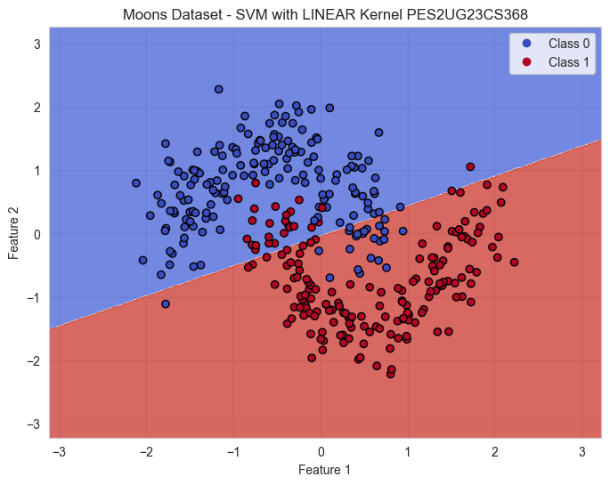

# Week 10: SVM Lab Report

> **Name:** Nathan Matthew Paul  
> **Section:** F  
> **SRN:** PES2UG23CS368  
> **Course Name:** Machine Learning  
> **Submission Date:** 2025-10-12

---

## Analysis Questions

### Moons Dataset Questions

#### 1. Inferences about the Linear Kernel's performance

The Linear Kernel performs poorly on the Moons dataset because the data is inherently non-linear with crescent-shaped patterns that cannot be separated by a straight line. The linear boundary results in significant misclassification and lower metrics compared to non-linear kernels, demonstrating that linear models cannot handle non-linear patterns effectively.

#### 2. Comparison between RBF and Polynomial kernel decision boundaries

**RBF Kernel:** Creates smooth, curved decision boundaries that naturally follow the moon shapes with flexible adaptation to local data structure.

**Polynomial Kernel:** Creates more angular or wavy boundaries that appear more rigid.

**Conclusion:** The RBF kernel captures the Moons data shape more naturally through its Gaussian-based transformation, allowing arbitrary curved boundaries without polynomial constraints.

---

### Banknote Dataset Questions

#### 1. Which kernel was most effective for this dataset?

The **Linear Kernel** or **RBF Kernel** performs most effectively because the Banknote dataset features are more linearly separable. The Linear Kernel achieves high accuracy with lower computational cost and better interpretability, while RBF adds flexibility for minor non-linearities. Effectiveness is confirmed by comparing classification metrics.

#### 2. Why might the Polynomial kernel have underperformed here?

The Polynomial kernel underperforms due to:
- **Overfitting:** Creates overly complex boundaries fitting noise rather than patterns
- **Unnecessary Complexity:** The simple Banknote data doesn't require complex polynomial transformations
- **High Dimensionality:** Dramatically increases feature space, leading to poor generalization
- **Hyperparameter Sensitivity:** Requires careful tuning of degree and coefficient parameters

---

### Hard vs. Soft Margin Questions

#### 1. Which margin (soft or hard) is wider?

**Soft Margin SVM (C=0.1)** produces a wider margin. Low C prioritizes maximizing margin width even if some points fall within or are misclassified. **Hard Margin (C=100)** tries to classify all points correctly, resulting in a narrower margin tightly fitting the training data.

#### 2. Why does the soft margin model allow "mistakes"?

Soft Margin allows mistakes to:
- Balance margin width maximization with classification error minimization
- Increase robustness to outliers and noise
- Improve generalization on unseen data
- Handle real-world datasets with overlapping classes or noisy labels

#### 3. Which model is more likely to be overfitting and why?

**Hard Margin SVM (C=100)** is more likely overfitting because it heavily penalizes violations, forcing the boundary to correctly classify every training point. This creates sensitivity to noise and unnecessarily complex boundaries that capture random fluctuations rather than true patterns, performing poorly on new data.

#### 4. Which model would you trust more for new data and why?

**Soft Margin SVM (C=0.1)** is more trustworthy for new data due to better generalization, noise tolerance, and overfitting prevention. In real-world scenarios with noisy data, starting with lower C values is preferred. The soft margin follows Occam's Razor: simpler models capturing essential patterns are preferred over complex models perfectly fitting training data.

---

## Screenshots

### Training Results

**Moons Dataset:**

**Banknote Dataset:**

### Decision Boundary Visualizations

**Margin Analysis:**

