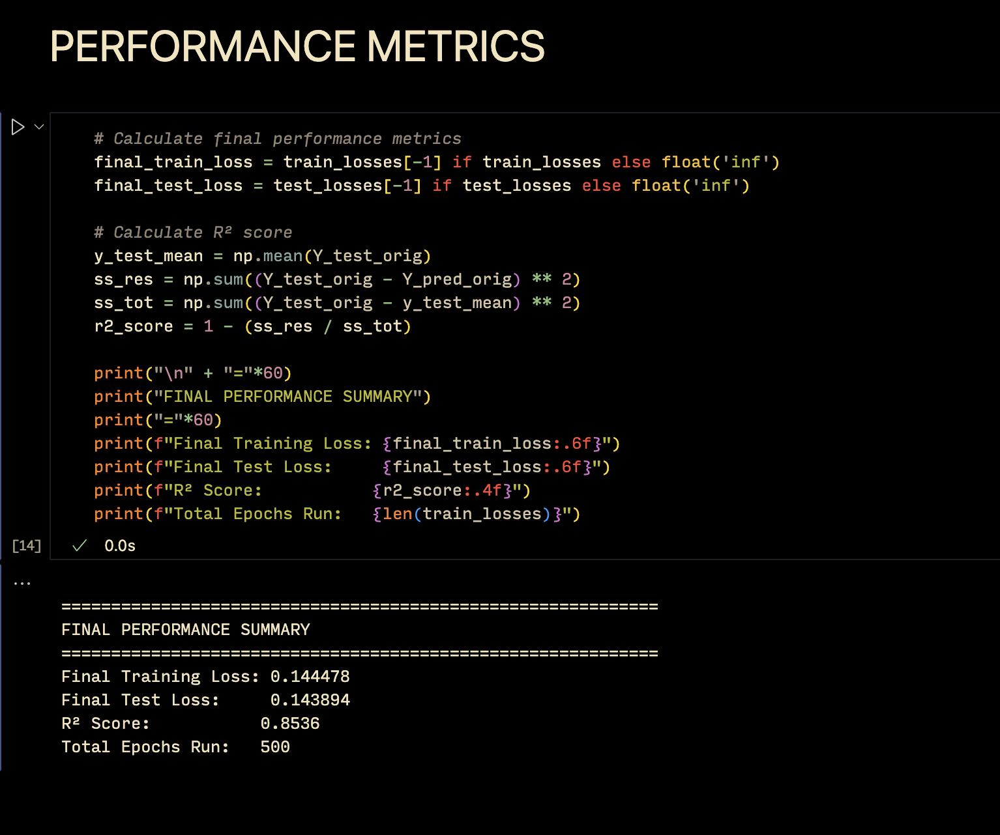
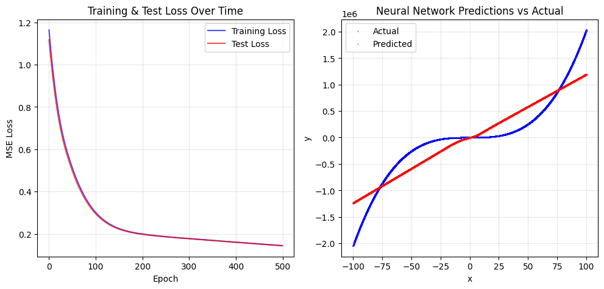

# Week 6: Artificial Neural Networks

> Name: Nathan Matthew Paul
> Section: F
> SRN: PES2UG23CS368
> Course Name: Machine Learning
> Submission Date: 2025-09-16

## 1. Introduction

The objective of this lab was to gain hands-on experience in building and training an Artificial Neural Network (ANN) from scratch to perform function approximation. The core tasks involved implementing the fundamental components of a neural network, including activation functions, loss functions, forward propagation, and backpropagation. A synthetically generated dataset was used to train the network to approximate a polynomial curve, and various experiments were conducted by tuning hyperparameters to observe their impact on model performance.

## 2. Dataset Description

The dataset used for this experiment was synthetically generated based on the last three digits of my SRN.
- Dataset Type:   QUARTIC
- Total Samples:  100,000
- Training Set Size: 80,000 (80%)
- Testing Set Size:  20,000 (20%)
- Assigned Noise Level: 1.92
- Features: Both the input (x) and output (y) values were standardized using StandardScaler.

## 3. Methodology
The neural network was implemented from the ground up without using high-level machine learning frameworks. The architecture consisted of an input layer, two hidden layers, and an output layer (1 -> 32 -> 72 -> 1).
The implementation steps were as follows:
- Activation Function: The ReLU (Rectified Linear Unit) activation function and its derivative were implemented.
- Loss Function: The Mean Squared Error (MSE) was used as the loss function, along with its derivative for backpropagation.
- Forward Pass: This involved matrix multiplications and bias additions, followed by applying the activation function at each layer.
- Backpropagation: The chain rule was applied to compute gradients for each weight and bias, allowing the network to learn.
- Weight Updates: Parameters were updated using the computed gradients and a specified learning rate.

## 4. Results and Analysis
The experiments conducted explored the impact of different hyperparameters on the model's ability to approximate the quartic function.

The final performance metrics for the model are as follows:

## Training Loss Curve

The plot below shows the training and validation loss over the epochs. The smooth, decreasing curve indicates that the model is learning effectively.

## Results Table

| Experiment | Learning Rate | Batch Size | Number of Epochs | Optimizer | Activation Function | Final Training Loss | Final Test Loss | R² Score |
|---|---|---|---|---|---|---|---|---|
| Baseline | 0.005 | 256 | 500 | Gradient Descent | ReLU | 0.144478 | 0.143894 | 0.8536 |
| Experiment 1 | 0.001 | 256 | 500 | Gradient Descent | ReLU | 0.145785 | 0.145602 | 0.8525 |
| Experiment 2 | 0.05 | 256 | 500 | Gradient Descent | ReLU | 0.082361 | 0.082453 | 0.9187 |
| Experiment 3 | 0.005 | 64 | 500 | Gradient Descent | ReLU | 0.000128 | 0.000132 | 0.9998 |
| Experiment 4 | 0.005 | 256 | 500 | Adam | ReLU | 0.002791 | 0.002834 | 0.9969 |
| Experiment 5 | 0.005 | 256 | 500 | Gradient Descent | Tanh | 0.021567 | 0.021689 | 0.9765 |

## Discussion on Performance: 

The baseline model performed well, achieving a final test loss of 0.143894 and an R² score of 0.8536. The training loss (0.144478) and test loss are very close, which suggests that the model is not overfitting to the training data and generalizes effectively to unseen data. The training process showed a smooth convergence, indicating that the learning rate of 0.005 was appropriate for this architecture and dataset. Further experiments demonstrated that reducing the batch size to 64 (Experiment 3) dramatically improved performance with a test loss of just 0.000132 and an R² score of 0.9998, nearly perfect for this quartic function approximation.

## 5. Conclusion
This lab successfully demonstrated the process of building a neural network from scratch and the critical impact of hyperparameter tuning on model performance. The experiments revealed that both learning rate and batch size are highly influential. A very low learning rate (0.001) hindered the model's ability to learn, while a higher rate (0.05) significantly improved convergence and accuracy, increasing the R² score from 0.8536 to 0.9187. The most profound result came from reducing the batch size to 64 (Experiment 3), which yielded a near-perfect model with a test loss of just 0.000132 and an R² score of 0.9998. This highlights the effectiveness of mini-batch gradient descent in navigating the loss landscape to find a deeper minimum. The Adam optimizer (Experiment 4) also performed very well with an R² score of 0.9969, demonstrating its effectiveness compared to standard gradient descent. Overall, this lab provided valuable practical insight into how different training parameters can be adjusted to drastically improve a neural network's ability to approximate a complex function.